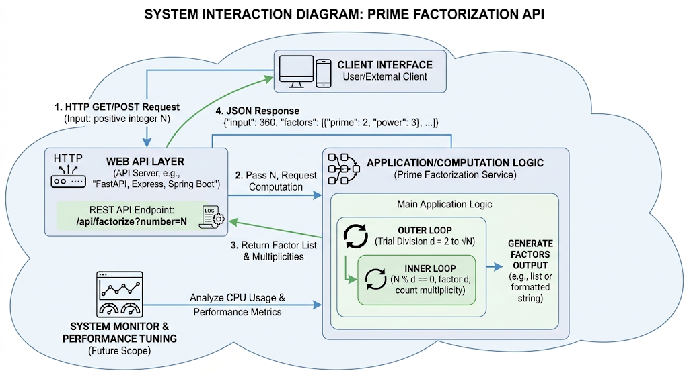

# Software Engineering Project Starter Code

This repo will start you off with an initial configuration that you'll modify as part of Checkpoint 1. As part of the modifications, you'll eventually delete the contents of this README and replace it with documentation for your brother.

# Computation 

This will use the system to find Prime Factors of the given number. 

## Input/Output
Input: A positive whole number
Output: A list of all the used prime numbers and how many times it was used

## Thought Process
Outer loop: this will be the loop that satrts from 2 to see if they can divide the input num.
Inner Loop: divides the input repeatedly by the factor as long as it divides evenly keeping track on how many times it was used. 

The larger the number the more it has to do 

## Examples

Example 1:
    input 6
    output 2*3

Example 2:
    input 360
    output 2*2*2*3*3*5 or 2^3*3^2*5 

Example 3:
    input 7
    output 7

## Image

